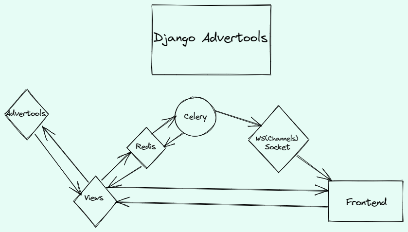

# django-advertools

A wrapper for the advertools library to show different functionalities in django

This Project utilizies the library named **Advertools** https://advertools.readthedocs.io/en/master/ created by eliasdabbas (https://github.com/eliasdabbas). The library consists of different helper functionalities ranging from Search Engine Optimization (SEO), Search Engine Marketing (SEM), Text Analysis. The workaround with pandas to view data makes it easily analyzable and viewable based on attributes and fields associated with the functionality.

## Tools and Technologies used

- Python
- Django
- ChartJS
- Celery
- flower
- Pandas
- Y Data Profiling
- Data Tables Jquery
- Select2 js lib

## What does this project Do:

This django wrapper utilizes the above mentioned tools and technologies in order to create and implement those feature with user associated input as well as preprocessing some inputs for making it appropriate to pass as a parameter for those methods. The project utilizes Data Tables library of jquery to view pandas tables (i.e. converted to html table) in template in paginated format with additional feature to search the table, view only selected column as well as exporting the table in csv, excel, pdf, etc. The ChartJS library is used to create charts for few feature to visually represent data to show an overview as well as distinction for few of the dataset. The forms are organzied and prioritized based on the required and optional fields in the templates and django forms.

## System Overview:



## How to run this project

- Create .env file based on the sample.
  Refer to this url https://advertools.readthedocs.io/en/master/advertools.serp.html for the stps to create credentials and add it to the env file.
  Similarly use this url https://advertools.readthedocs.io/en/master/advertools.knowledge_graph.html#account-setup to setup knowledge graph as well in the same project for google creds

- Setup venv, activate and install packages from requirements.txt

```
python -m venv venv
```

```
venv\Scripts\activate # for windows
venv\bin\activate # for linux
```

```
pip install -r requirements.txt
```

- Migrate the database changes

```
python manage.py migrate
```

- Run django server

```
python manage.py runserver
```

- Run Celery

```
celery -A django_advertools worker -l info -P solo #p solo for pool solo arg in win for execution
```

Optional Arguments if celery is receiving the tasks but not executing

```
--without-gossip --without-mingle --without-heartbeat -Ofair
```

- Setup Flower
  Find the asyncio.py file and edit the line below from the installed package

```
import sys

if sys.platform == 'win32':
    asyncio.set_event_loop_policy(asyncio.WindowsSelectorEventLoopPolicy())
```

- Start Flower:

```
flower -A core --port=5555
```

# Deploy in VPS

- Connect to VPS


- Install Packages

create a venv
use the "install_venv_batch.sh" or install from requirements.txt
if there is memory issue then the "install_venv_batch.sh" splits the requirements.txt file and install seperately in the venv

- Install redis-server

```
sudo apt-get install redis-server
```

- Create an exception for port 8000
ufw is a front-end for iptables and provides an easier way to manage firewall rules on Ubuntu and other Debian-based systems.
```
sudo ufw allow 8000
```
If not installed 
```
sudo apt update
```
**then**
```
sudo apt install ufw
```
and enable
```
sudo ufw enable
```
and check status
```
sudo ufw status
```
You can then re-run the ufw allow 8000 cmd

***If ssl enabled need to also allow port 443 to accept request**
```
sudo ufw allow 443
```

- simply run the server in venv 
```
python manage.py runserver 0.0.0.0:8000
```

## Running Celery and Django from VPS using split terminal

To run both Celery and the Django server from one terminal on your VPS (Virtual Private Server), you can use a tool like `tmux` or `screen`. These tools allow you to create multiple terminal sessions within a single terminal window, making it easy to manage multiple processes simultaneously.

Here's a step-by-step guide on how to achieve this using `tmux`:

1. **Install tmux (if not already installed)**:

   If `tmux` is not installed on your VPS, you can install it using your package manager. For example, on Ubuntu, you can run:

   ```bash
   sudo apt update
   sudo apt install tmux
   ```

2 **Run the Shell Script with tmux enabled which runs both simultaneously**:

    Making the shell script executable 
    ```
    chmod +x run_application.sh
    ```

    Run the executable shell script
    ```
    ./run_application.sh
    ```

    The above command runs celery and django in split terminal session using the tmux package
    You can switch between the terminal with cmd **Ctrl + b + arrow Key Up/Down**
    
    Exit the session for using
    "Ctrl + d and b" on both 


2 **Django_advertools configuration set cmd for nginx**:
    
    Create a configuration for django advertools.smartmgr.com
    ```
    sudo nano /etc/nginx/sites-available/advertools.smartmgr.com
    ```
    
    create a linux based link using the cmd below so updates are synced for sites-available
    ```
    sudo ln -s /etc/nginx/sites-available/advertools.smartmgr.com /etc/nginx/sites-enabled/
    ```
    Restart the nginx
    ```
    sudo service nginx restart
    ```


3 **Create Services for linux using systemd**:
Using systemd service and socket files allows a more robust way of starting and stopping the application server.
The Gunicorn socket will be created at boot and will listen for connections. When a connection occurs, systemd will automatically start the Gunicorn process to handle the connection.

the below is the gunicorn socket file
```
[Unit]
Description=gunicorn socket

[Socket]
ListenStream=/run/gunicorn.sock

[Install]
WantedBy=sockets.target
```

Next a systemd service file is created for config

```sudo nano /etc/systemd/system/gunicorn.service```

> **_NOTE:_** Make Sure all the configurations and path match correctly.
Configure the path and project directory according to yours for eg. the below is for django advtools:
```
[Unit]
Description=gunicorn daemon
Requires=gunicorn.socket
After=network.target

[Service]
User=tactical
Group=www-data
WorkingDirectory=/home/tactical/django-advertools
ExecStart=/home/tactical/django-advertools/venv/bin/gunicorn \
          --access-logfile - \
          --workers 3 \
          --bind unix:/run/gunicorn.sock \
          django_advertools.wsgi:application

[Install]
WantedBy=multi-user.target
```
Once setup you need to start and enable the service to run
```
sudo systemctl start gunicorn.socket
sudo systemctl enable gunicorn.socket
```

After the creation of daphne.service 
> **_NOTE:_** after creation or update daemon-reload should be executed (i.e. reload all the background processes running)
```
 sudo systemctl daemon-reload
```
and enable 
```
sudo systemctl start daphne.service
```
similarly lookup on the status of the service
```
 sudo systemctl status daphne.service

```


4 **Configure the systemd application to run using nginx**:
Once the above gunicorn and daphne server is ran the below usage of asgi and wsgi in nginx is configured based on req. protocols and headers
```
server {
    server_name advertools.smartmgr.com www.smartmgr.com;

    location = /favicon.ico { access_log off; log_not_found off; }
    location /static/ {
        root /home/tactical/django-advertools/staticfiles;
    }
    
    location / {
        include proxy_params;
        proxy_pass http://unix:/run/gunicorn.sock;
    }

    location /ws/ {
        proxy_http_version 1.1;
        proxy_set_header Upgrade $http_upgrade;
        proxy_set_header Connection "upgrade";
        proxy_redirect off;
        proxy_pass http://0.0.0.0:8001;
    }
}
```

> **_NOTE:_**  If you are observing 404 not found for your staticfiles you must be having permission issues with nginx.

**To Resolve the permission issues of nginx**
Navigate to the directory you are observing the permission issue and list out the permission (typically add any path)
```
ls -l /path/to/your/django/project/staticfiles/ 
```
first chown (change owner)
```
 sudo chown -R nginx:nginx /home/tactical/django-advertools/staticfiles
```
add permission here 755- read write and execute perms
```
sudo chmod -R 755 /home/tactical/django-advertools/staticfiles
```

**Get the unix service created logs**
Essential if any disruption occuring.
In my case there was a service already running with daphne sock so had to stop that and disable in order to start the configured server.
```
sudo journalctl -u daphne.service
```


